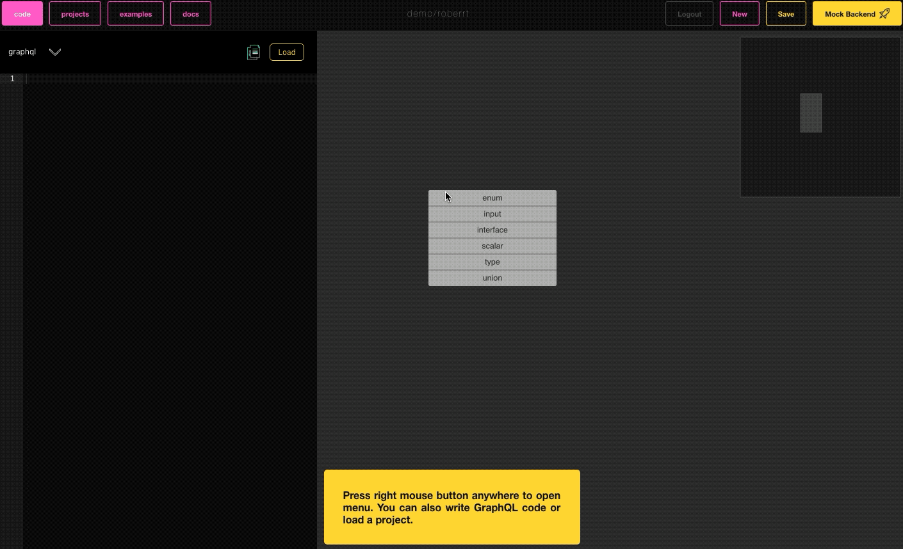
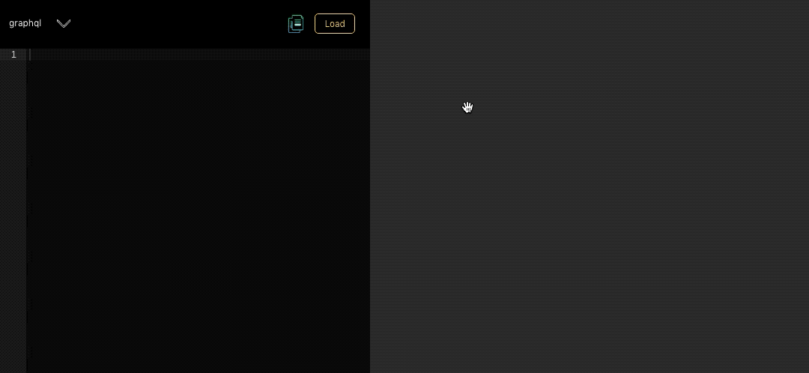
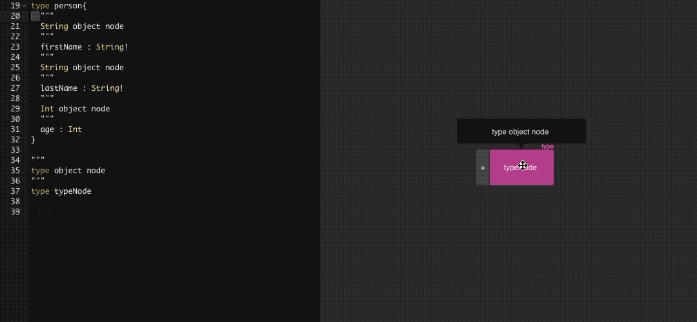
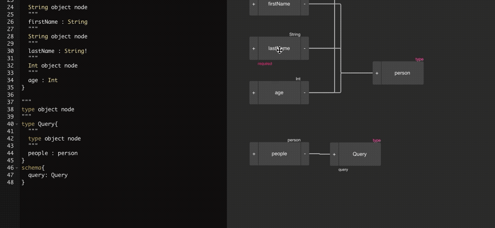
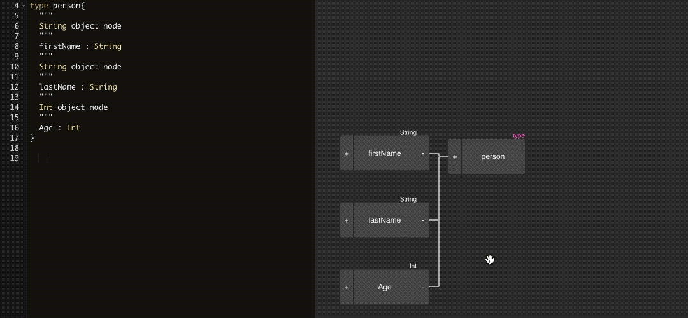

# GraphQL Editor
[](https://www.npmjs.com/package/graphql-editor)


GraphQLEditor makes it easier to understand GrapHQL schemas. Create a schema by joining visual blocks. GraphQLEditor will transform them into code.

With GraphQLEditor you can create visual diagrams without writing any code.

## Live Demo [](https://twitter.com/intent/tweet?text=First%20visual%20GraphQL%20Editor&url=https://github.com/slothking-online/graphql-editor)

Here is a [live demo](https://graphqleditor.com) example of GraphQLEditor.

## Docs

Full docs are available here. How to use in your project, develop etc.

https://docs.graphqleditor.com

## License

MIT

## How It Works

Create GraphQL nodes and connect them to generate a database schema. You can also use builtin text IDE with GraphQL syntax validation

## GraphiQL in Cloud
[live demo](https://app.graphqleditor.com) also provides [GraphiQL](https://faker.graphqleditor.com/showcase/fake-twitter/graphql) in cloud and faker based GraphQL mock backend

## Develop or use standalone

```
npm i graphql-editor
```

```tsx
import * as React from 'react';
import { render } from 'react-dom';
import { Editor } from '../src/index';

class App extends React.Component<
  {},
  {
    editorVisible: boolean;
  }
> {
  state = {
    editorVisible: true
  };
  render() {
    return (
      <div
        style={{
          width: '100%',
          height: '100%',
          display: 'grid',
          gridTemplateColumns: this.state.editorVisible ? `auto 1fr` : '1fr',
          gridTemplateRows: '1fr'
        }}
      >
        <Editor editorVisible={this.state.editorVisible} />
      </div>
    );
  }
}

render(<App />, document.getElementById('root'));
```

## Basic Operations

### Create Type


### Tag root query, mutation, operation


### List and non-null types


### Connecting nodes



## Support 

Ask the community on [Spectrum](https://spectrum.chat/graphql-editor)

or [Join our Slack Channel](https://join.slack.com/t/graphqleditor/shared_invite/enQtNDkwOTgyOTM5OTc1LWI4YjU3N2U5NGVkNzQ2NzY5MGUxMTJiNjFlZDM1Zjc2OWRmNTI0NDM3OWUxYTk4Yjk3MzZlY2QwOWUzZmM2NDI)

## Contribute

For a complete guide to contributing to GraphQL Editor, see the [Contribution Guide](CONTRIBUTING.md).

1.  Fork this repo
2.  Create your feature branch: git checkout -b feature-name
3.  Commit your changes: git commit -am 'Add some feature'
4.  Push to the branch: git push origin my-new-feature
5.  Submit a pull request


## Cloud Backend

[GraphQL Editor Website](https://graphqleditor.com)

As cloud backend is coming soon, please do subscribe on our website to stay tuned.

## Underlying Diagram technology

Whole graphql-editor is based on underlying [diagram](https://github.com/slothking-online/diagram) technology. We need much more help there feel free to contribute!