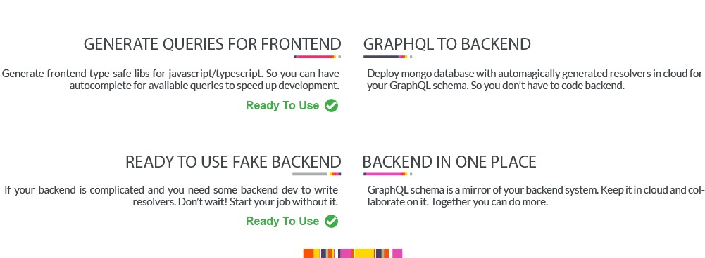

GraphQLEditor makes it easier to understand GrapHQL schemas. Create a schema by joining visual blocks. GraphQLEditor will transform them into code.

With GraphQLEditor you can create visual diagrams without writing any code.

## Live Demo 

Here is a [live demo](https://app.graphqleditor.com) example of GraphQLEditor.

## Docs

Full docs are available here. How to use in your project, develop etc.

https://docs.graphqleditor.com

## Cloud Backend

[GraphQL Editor Website](https://graphqleditor.com)

As cloud backend is coming soon, please do subscribe on our website to stay tuned.

## License

MIT

## How It Works

Create GraphQL nodes and connect them to generate a database schema.

To create nodes press and hold *spacebar*, then hover mouse button on chosen category. Click the mouse button on node to create it. Connect nodes with each other.

## Support 

Ask the community on [Spectrum](https://spectrum.chat/graphql-editor)

or [Join our Slack Channel](https://join.slack.com/t/graphqleditor/shared_invite/enQtNDkwOTgyOTM5OTc1LWI4YjU3N2U5NGVkNzQ2NzY5MGUxMTJiNjFlZDM1Zjc2OWRmNTI0NDM3OWUxYTk4Yjk3MzZlY2QwOWUzZmM2NDI)

## Contribute

For a complete guide to contributing to GraphQL Editor, see the [Contribution Guide](CONTRIBUTING.md).

1.  Fork this repo
2.  Create your feature branch: git checkout -b feature-name
3.  Commit your changes: git commit -am 'Add some feature'
4.  Push to the branch: git push origin my-new-feature
5.  Submit a pull request

