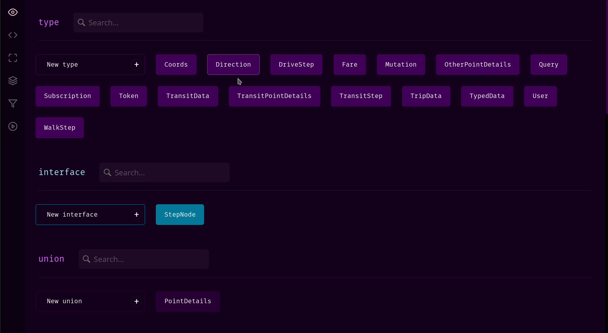

[](https://graphqleditor.com)

[](https://www.npmjs.com/package/graphql-editor) [](http://commitizen.github.io/cz-cli/) [](https://www.npmjs.com/package/graphql-editor)

GraphQLEditor makes it easier to understand GraphQL schemas. Create a schema by using visual blocks system. GraphQL Editor will transform them into code. With GraphQL Editor you can create visual diagrams without writing any code or present your schema in a nice way!

### Cloud version

Here is a [cloud version](https://graphqleditor.com) of GraphQL Editor.

## Docs

Here is a [guide](https://guide.graphqleditor.com) for GraphQL Editor.

## How it works

Create GraphQL nodes and connect them to generate a database schema. You can also use builtin text IDE with GraphQL syntax validation



## Table of contents

- [Docs](#docs)
- [How it works](#how-it-works)
- [Table of contents](#table-of-contents)
- [License](#license)
- [Develop or use standalone](#develop-or-use-standalone)
- [Support](#support)
- [Team](#team)
- [Underlying Parsing technology](#underlying-parsing-technology)
- [GraphQL Tutorials](#graphql-tutorials)

## License

MIT

## Develop or use standalone

To use standalone you have to use webpack right now. If you want to use it without webpack you need to handle monaco editor workers yourself.

Install dependencies

```
npm i react react-dom monaco-editor @monaco-editor/react
```

```
npm i -D worker-loader css-loader file-loader
```

```
npm i graphql-editor
```

```tsx
import React, { useState } from 'react';
import { render } from 'react-dom';
import { GraphQLEditor, PassedSchema } from 'graphql-editor';

const schemas = {
  pizza: `
type Query{
	pizzas: [Pizza!]
}
`,
  pizzaLibrary: `
type Pizza{
  name:String;
}
`,
};

export const App = () => {
  const [mySchema, setMySchema] = useState<PassedSchema>({
    code: schemas.pizza,
    libraries: schemas.pizzaLibrary,
  });
  return (
    <div
      style={{
        flex: 1,
        width: '100%',
        height: '100%',
        alignSelf: 'stretch',
        display: 'flex',
        position: 'relative',
      }}
    >
      <GraphQLEditor
        onSchemaChange={(props) => {
          setMySchema(props);
        }}
        schema={mySchema}
      />
    </div>
  );
};

render(<App />, document.getElementById('root'));
```

## Support

[Join our Discord Channel](https://discord.gg/wVcZdmd)

## Team

[GraphQL Editor Website](https://graphqleditor.com)

## Underlying Parsing technology

Whole graphql-editor parsing stuff is based on underlying [zeus](https://github.com/graphql-editor/graphql-zeus) technology.

## GraphQL Tutorials

Interactive GraphQL Tutorial [here](https://app.graphqleditor.com/?step=intro)

GraphQL Editor Guide [here](https://guide.graphqleditor.com/)

GraphQL Blog [here](https://blog.graphqleditor.com/)
