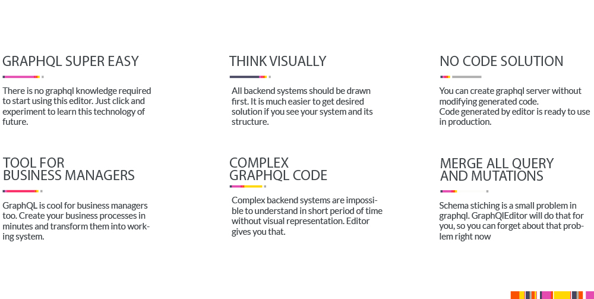
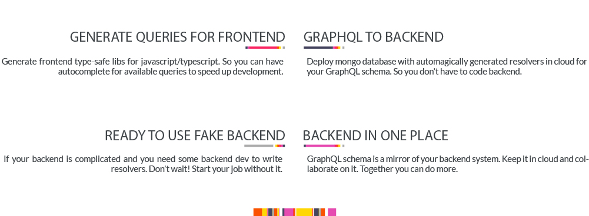

Graphql editors makes it easier to understand graphql schema. Create schema by joining visual blocks. GraphQLEditor will transform them into code.

With GraphQLEditor you can create visual diagrams without writing any code. 



## Live Demo

Here is [Live demo](https://demo.graphqleditor.com) of GraphQLEditor 

## Setup

Clone the repository
```
$ git clone https://github.com/slothking-online/grqphql-editor
$ cd graphql-editor
```

Install with npm package manager

```
$ npm install
```

## Running

```
$ npm run start
```

Adter that you should have editor running on 
```
http://localhost:1569
```


## How it works

Create GraphQL nodes and connect them to generate database schema.


To create nodes press and hold spacebar then hover mouse button on chosen category. Click the mouse button on node to create it. Connect nodes with each other.

### Controls

- Create - press and hold Spacebar and choose category -> node and Left Mouse Button click
- Pan - press and hold Left Mouse Button and move mouse
- Move - press and hold Left Mouse Button on node
- Rename - To rename node simply start typing when one node is selected
- Connect - Click and hold desired node output and move it to other node's output then release mouse button
  IMPORTANT: Every node is connectable only if it creates valid schema. Experiment to test
- Node Properties - Click right mouse button on node
- CMD/CTRL + Left Mouse Button Click - select multiple nodes
- Delete - Click delete button when node/nodes are selected or right click -> delete

### Small tutorial

1. Create graph -> "type" node
2. Rename it to "Cat"
3. Create fields -> "String" node
4. Rename it to "name"
5. Connect "name"


## Contribute

Feel free to contact us and contribute in graphql editor project. aexol@aexol.com


