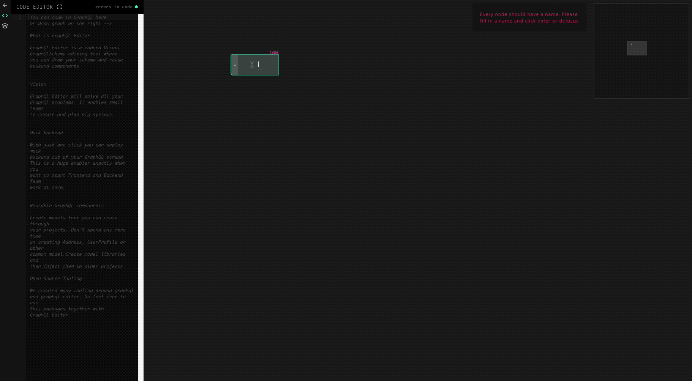
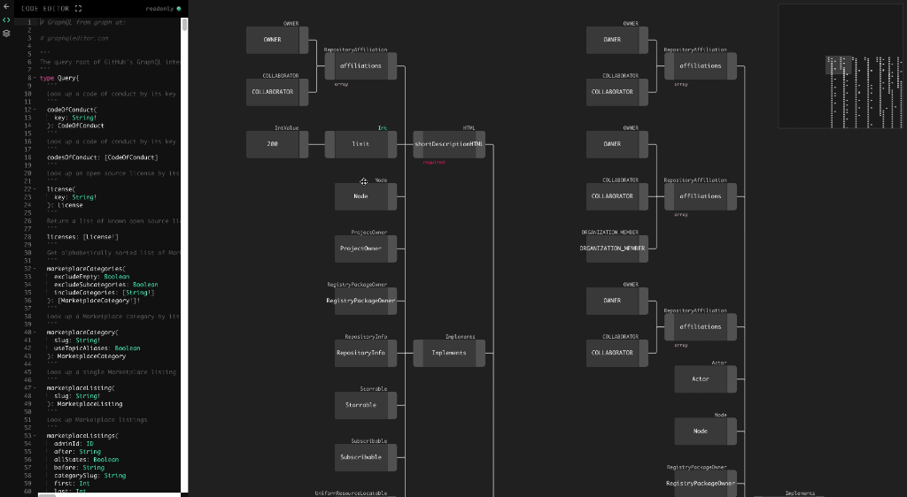

[](https://graphqleditor.com)

[](https://www.npmjs.com/package/graphql-editor) [](http://commitizen.github.io/cz-cli/) [](https://www.npmjs.com/package/graphql-editor)

GraphQLEditor makes it easier to understand GrapHQL schemas. Create a schema by joining visual blocks. GraphQLEditor will transform them into code. With GraphQLEditor you can create visual diagrams without writing any code or present your schema in a nice way!
### Cloud version

Here is a [cloud version](https://graphqleditor.com) of GraphQLEditor. Which also contains:
- cloud project management and versioning
- team libraries
- schema libraries
- live schema mock backend deployment
- frontend engine to play with mock backend
- live collaboration

## How it works

### Create GraphQL Schemas

[]

### Explore Large GraphQL Schemas

[


## Table of contents
- [How it works](#how-it-works)
  - [Create GraphQL Schemas](#create-graphql-schemas)
  - [Explore Large GraphQL Schemas](#explore-large-graphql-schemas)
- [Table of contents](#table-of-contents)
- [Developer Docs](#developer-docs)
- [License](#license)
- [How It Works](#how-it-works-1)
- [Develop or use standalone](#develop-or-use-standalone)
- [Support](#support)
- [Contribute](#contribute)
- [Team](#team)
- [Underlying Diagram technology](#underlying-diagram-technology)
- [Underlying Parsing technology](#underlying-parsing-technology)
- [GraphQL Tutorials](#graphql-tutorials)

## Developer Docs

If you wish to contribute docs from `typedoc` are availble on [https://graphql-editor.github.io/graphql-editor/](https://graphql-editor.github.io/graphql-editor/)

## License

MIT

## How It Works

Create GraphQL nodes and connect them to generate a database schema. You can also use builtin text IDE with GraphQL syntax validation

## Develop or use standalone

Install dependencies

```
npm i react react-dom monaco-editor
```

and if you are using webpack

```
npm i -D monaco-editor-webpack-plugin worker-loader css-loader file-loader
```

```
npm i graphql-editor
```

```tsx
import React from 'react';
import { render } from 'react-dom';
import { Editor } from 'graphql-editor';
export const App = () => {
  const [mySchema, setMySchema] = useState<PassedSchema>({
    code: `type Person{ 
      """
      very description of name
      """
      name: String
     }
     
     extend type User{
       password: String!
     }
     `,
    libraries: `
     type User{
       name: String
     }
     `,
  });
  return (
    <div className={UiDiagram}>
      <Editor
        onSchemaChange={(props) => {
          setMySchema(props);
        }}
        initialSizeOfSidebar={'25vw'}
        schema={mySchema}
      />
    </div>
  );
};

render(<App />, document.getElementById('root'));
```

## Support 

[Join our Discord Channel](https://discord.gg/xREyAec)

## Contribute

For a complete guide to contributing to GraphQL Editor, see the [Contribution Guide](CONTRIBUTING.md).

1.  Fork this repo
2.  Create your feature branch: git checkout -b feature-name
3.  Commit your changes: git commit -am 'Add some feature'
4.  Push to the branch: git push origin my-new-feature
5.  Submit a pull request

## Team 

[GraphQL Editor Website](https://graphqleditor.com)

## Underlying Diagram technology

Whole graphql-editor is based on underlying [diagram](https://github.com/graphql-editor/diagram) technology. We need much more help there feel free to contribute!

## Underlying Parsing technology

Whole graphql-editor parsing stuff is based on underlying [zeus](https://github.com/graphql-editor/graphql-zeus) technology. We need much more help there feel free to contribute!

## GraphQL Tutorials

Best GraphQL tutorials [here](https://blog.graphqleditor.com/top-graphql-tutorials-reviewed-2019)

My Video Blog Tutorials [here](https://stackofthefuture.com)
